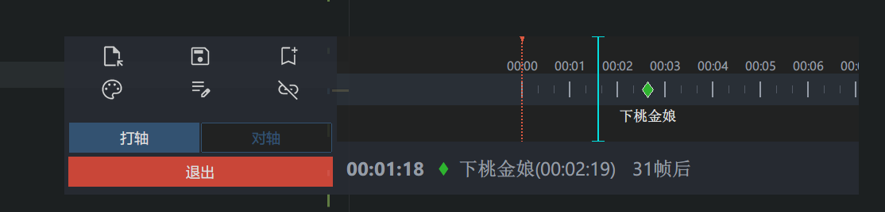

# Arknights Cost Bar Ruler + Timeline Tool

# 明日方舟费用条尺子 & 打轴器 v2.1

一个为《明日方舟》设计的帧数测量与时间轴工具集，包含**费用条尺子**（实时帧数测量）和**打轴/对轴器**（多轨道时间轴编辑与提醒）两个独立程序。

> **本项目代码完全由 AI（Claude Code）辅助编写，作者没有任何编程基础。第一次维护 GitHub 仓库，如果有什么地方做得不妥，欢迎各位大佬多担待，欢迎提 Issue 指正！**
>
> 本版本为 fork 自 [ZeroAd-06/ArknightsCostBarRuler](https://github.com/ZeroAd-06/ArknightsCostBarRuler) 的增强版，包含多轨道打轴器、节点预告、比例尺缩放、干员头像、JSON↔Excel 转换等大量优化。




---

## 目录

- [功能概览](#功能概览)
- [快速开始 — 费用条尺子](#快速开始--费用条尺子)
- [快速开始 — 打轴/对轴器](#快速开始--打轴对轴器)
- [快捷键参考](#快捷键参考)
- [JSON ↔ Excel 小工具](#json--excel-小工具)
- [从源码运行](#从源码运行)
- [注意事项](#注意事项)
- [API](#api)
- [更新日志](#更新日志)
- [许可 & 致谢](#许可--致谢)

---

## 功能概览

### 费用条尺子

- **自适应费用条速度变化**：校准系统可以轻松处理三减费、二减费等环境，快速切换不同的费用校准文件。
- **实时显示**：几乎无延迟的悬浮窗，实时反馈当前帧数。
- **广泛的模拟器支持**：
  - **MuMu模拟器12** 与 **雷电模拟器9** 截图增强：速度极快。
  - **通用 Minicap 截图方案**：兼容绝大多数 Android 9 及以下的模拟器。
- **分辨率自适应**：自动计算费用条位置，无需手动设置。
- **用户友好**：首次运行提供连接设置向导、自动化的校准流程、可拖动的半透明悬浮窗，不遮挡游戏画面。
- **全局计时器 & 停表**：左下角显示游戏内时间，点击可切换停表模式。

### 打轴/对轴器

- **多轨道时间轴**：支持同时管理多条独立轨道，每条轨道可单独设置模式、颜色、提醒。
- **实时帧数同步**：通过 WebSocket 连接尺子，实时获取当前游戏帧数。
- **打轴模式**：自由添加/删除节点，记录操作时间点。
- **对轴模式**：节点预告、声音/视觉提醒、时间流逝时自动吸附锁定。
- **比例尺缩放**：全局缩放 + 单轨道独立缩放，键盘快捷调整。
- **节点跳转**：时间静止时快速跳转到前一个/后一个节点。
- **干员头像替换**：节点名称中输入 `[编号/名称/昵称]` 自动显示对应干员头像。
- **保存时规范化命名**：支持多预设命名规则（极简 / 日常 / 合约），自动组合字段生成文件名。
- **JSON ↔ Excel 互转**：方便用 Excel 编辑时间轴后再导回。

---

## 快速开始 — 费用条尺子

1. **下载**：前往 [Releases 页面](../../releases) 下载最新的 `费用尺+打轴器_YYYYMMDD.zip`。
2. **运行**：解压后运行 `ArknightsCostBarRuler_YYYYMMDD.exe`（会自动请求管理员权限，用于调用模拟器工具）。
3. **首次配置**：
   - 程序会弹出设置向导。
   - 选择您使用的模拟器类型（MuMu12 / 雷电9 / 通用 Minicap）。
   - 填写模拟器安装路径或 ADB 连接参数。
   - 点击"保存并启动"。
4. **首次校准**：
   - 程序启动后，悬浮窗会提示您选择配置文件。
   - 右键程序的托盘图标，选择 `校准配置 > -- 新建 --`。
   - 进入任意关卡。
   - **点击一个地图上的干员（或者可选中单位，让游戏进入慢速模式）**。
   - 点击悬浮窗左侧按钮开始校准。
5. **开始使用**：
   - 校准完成后，悬浮窗将实时显示当前帧数。
   - 悬浮窗左下角是**全局计时器**，显示当前游戏内时间。
   - 点击全局计时器，悬浮窗左上角会出现**停表**，显示相对帧数；再次点击全局计时器可让停表消失。
   - 如果费用回复速率发生变化（如切换减费tag），请右键托盘图标，在 `校准配置` 中更换或新建配置。

---

## 快速开始 — 打轴/对轴器

1. **启动尺子**：确保费用条尺子已正常运行。
2. **运行**：解压目录中运行 `TimelineTool_YYYYMMDD.exe`。
3. **连接**：打轴器会自动通过 WebSocket（默认 `ws://localhost:2606`）连接尺子获取实时帧数。

### 轨道管理

- **新建/删除轨道**：点击左侧"新建轨道"/"删除轨道"按钮。轨道自动命名为 `轨道0`、`轨道1`...
- **重命名轨道**：双击轨道顶部的名称即可编辑。
- **折叠操作面板**：点击顶部栏的 `◀` 按钮可隐藏左侧操作面板，窗口宽度同步缩小；点击 `▶` 恢复。

### 模式切换

- **全部打轴**：将所有轨道切换为打轴模式。不改变当前的吸附状态，保持用户手动设置。
- **全部对轴**：将所有轨道切换为对轴模式，并**强制开启磁铁吸附**。
- **单轨道切换**：每个轨道左上角的模式按钮可独立切换。切换到对轴模式会自动开启吸附。

### 节点操作（打轴模式）

- **添加节点**：点击"添加节点"，将当前帧记录为一个新节点。
- **删除节点**：选中节点后点击"删除节点"。
- **重命名节点**：选中节点后在文本框中修改名称，按 Enter 确认。
- **切换颜色**：为节点分配不同颜色以便区分。
- **吸附节点**：点击节点，轨道会自动将当前时间对齐到该节点位置。

### 对轴辅助功能

- **节点预告**：对轴模式下，当时间靠近下个节点且进入警报范围时，轨道底部信息栏会显示 `还剩{x}帧`。每个轨道独立预告自己的下一个节点。
- **时间流逝吸附锁定**：当费用尺时间正在流逝时，对轴轨道会**强制保持吸附并锁定**，无法通过拖动解除；时间暂停或尺子停止时自动解除锁定。
- **提醒提前(帧)**：调整此值可控制声音/视觉提醒和节点预告的触发范围。
- **节点跳转**：时间静止时，点击轨道底部信息栏左侧的 `◀` / `▶` 按钮，可快速跳转到前一个或后一个最近的节点。跳转后自动解除该轨道的磁铁吸附。

### 比例尺缩放

- **全局缩放**（影响所有轨道）：`Ctrl + ↑` 放大 / `Ctrl + ↓` 缩小
- **单轨道缩放**（仅当前激活轨道）：`↑` 放大 / `↓` 缩小
- **平移时间轴**：`←` 向左移动 / `→` 向右移动（步进 30 帧）
- 缩放范围：`0.2x ~ 5.0x`，步进 `0.1`
- **注意**：费用尺时间流逝时禁止所有缩放和移动操作。

### 干员头像替换

- 节点名称中输入 `[编号/名称/昵称]` 时，会自动替换为对应干员头像。
- **示例**：
  - `[A41]开局部署` → 显示为 夜刀头像 + "开局部署"
  - `[ew]` → 显示为 维什戴尔头像
  - `[塞雷娅]` → 显示为 塞雷娅头像
- 头像与剩余文字水平并排显示，头像中心与文字顶部齐平，允许向上覆盖时间轴轨道。
- 昵称映射表位于 `operator_aliases.xlsx`（第一列为标准名称，后续列为别名），可自行编辑增删。

### 保存与命名

- **保存**：`Ctrl + S` 或点击"保存"按钮。
- **默认文件名**：自动生成为 `#mmddHHMM_Xo`（时间戳 + 轨道数），例如 `#06061530_3o`。
- **规范化命名对话框**（若 `naming_config.json` 中 `"enabled": true`）：
  - 支持"极简"/"日常"/"合约"三种预设命名规则。
  - 字段自动填入（轨道数、时间戳自动计算），确认后用 `_` 连接各字段合成文件名。
  - 可通过 `naming_config.json` 修改字段、增删预设，或关闭此功能。

### 窗口调整

- **拖动窗口**：拖拽顶部栏最左侧的 `⋮⋮` 手柄。
- **调整高度**：拖拽底部 `━━` 把手。
- **调整宽度**：拖拽右侧 `┃┃` 把手。
- **最小化高度**：折叠后窗口可缩到很小，单轨道也能紧凑显示。

---

## 快捷键参考

| 快捷键 | 作用 |
|--------|------|
| `Ctrl + S` | 保存时间轴 |
| `Ctrl + O` | 打开时间轴文件 |
| `Ctrl + ↑` / `Ctrl + ↓` | 全局缩放时间轴（所有轨道） |
| `↑` / `↓` | 单轨道缩放（当前激活轨道） |
| `←` / `→` | 平移时间轴（向左/右移动 30 帧） |

---

## JSON ↔ Excel 小工具

`小工具/` 目录下提供两个独立程序，方便在 JSON 轴文件与 Excel 之间互转：

### json_to_excel.exe

- 选择 JSON 轴文件，生成同名的 `.xlsx`。
- **Sheet `时间轴`**：第一列为帧数，第二列为 `MM:SS:FF` 格式时间，后续每列对应一个轨道，单元格为该帧的节点名称。
- **Sheet `设置`**：包含版本信息及各轨道的模式、磁铁、提醒开关、提前帧数等设置。

### excel_to_json.exe

- 选择由上述工具生成的 Excel 文件，还原为多轨道 JSON。
- 支持 `MM:SS:FF` 和纯帧数两种时间解析方式。
- 颜色按默认轮询分配。

> 提示：Excel 适合批量编辑节点名称、调整帧数，编辑完再用 `excel_to_json` 导回即可继续在打轴器中使用。

---

## 从源码运行

1. 克隆本仓库：
   ```bash
   git clone https://github.com/duke4994/ArknightsCostBarRuler_-.git
   ```
2. 下载 Minicap 二进制文件：`https://github.com/openatx/stf-binaries/tree/master/node_modules/minicap-prebuilt/prebuilt`，并添加到目录 `ruler/controllers/minicap/` 中。
3. 安装 Python 3.8+。
4. 安装依赖：
   ```bash
   pip install Pillow pystray ttkbootstrap websockets openpyxl pandas
   ```
5. 运行费用条尺子：
   ```bash
   python ruler/main.py
   ```
6. 运行打轴/对轴器：
   ```bash
   python timeline_tool/main.py
   ```

---

## 注意事项

### 费用条尺子

* 该程序在以下环境下**不可用**：
  - 部署费用已到达上限。
  - 部署费用无法自然回复（如剿灭作战）。
  - 部署费用自然回复被锁定（如第15章的"活性态萨卡兹术师结晶"（就是那个会发出锁链的））。
* 如果程序崩溃或无法正常工作，请尝试：
  - 关闭程序并重新打开。
  - 删除目录下的 `config.json`（会重置为首次配置向导）。
  - 使用发行版内的 `ArknightsCostBarRuler_Debug_YYYYMMDD.exe` 以调试模式启动，查看控制台输出。
  - 打包 `log/` 文件夹，在 [Issue 页面](../../issues) 报告问题。

### 打轴/对轴器

* 打轴器**需要费用条尺子正常运行**才能获取帧数，请确保尺子已启动。
* 若连接失败，请检查尺子是否正常运行，或 `timeline_tool/config.py` 中的 WebSocket 地址是否正确。
* 重启按钮（顶部栏 ↻）可在不关闭尺子的情况下重启打轴器；若有未保存修改会提示确认，重启后会自动重新打开之前的文件。

---

## API

本项目提供了一个实时的 WebSocket API，允许第三方工具获取帧数和计时器数据。打轴/对轴器就是基于这个 API 开发的一个示例应用。

**[点击此处查看 API 文档](API.md)**

您可以在 `api_test/` 目录下找到 API 客户端的示例代码，用于开发自己的应用程序。

---

## 更新日志

### v2.1 (2026-06-06)

#### 新增功能

- **比例尺缩放**：支持全局缩放（`Ctrl+↑/↓`）和单轨道独立缩放（`↑/↓`），并可用 `←/→` 平移时间轴。
- **节点跳转**：时间静止时，点击轨道底部的 `◀`/`▶` 按钮快速跳转到前后节点，跳转后自动解除吸附。
- **JSON ↔ Excel 小工具**：新增 `json_to_excel` 和 `excel_to_json`，方便用 Excel 批量编辑时间轴。
- **多预设命名配置**：保存时支持"极简"/"日常"/"合约"三种命名规则预设，字段自动填入。
- **左侧操作面板折叠**：点击 `◀`/`▶` 隐藏或展开左侧面板，节省屏幕空间。
- **重启按钮**：顶部栏新增 ↻ 按钮，可快速重启打轴器并自动恢复之前的文件。
- **节点预告**：对轴模式下，当下个节点进入警报范围时显示 `还剩{x}帧`，各轨道独立预告。
- **时间流逝吸附锁定**：对轴轨道在时间流逝时强制吸附并锁定，无法通过拖动解除。
- **干员头像替换**：节点名称输入 `[编号/名称/昵称]` 自动替换为 417 张干员头像之一。
- **保存时规范化命名**：可配置字段，自动组合生成文件名。

#### 优化与修复

- **多轨道支持**：可同时管理多条独立时间轴轨道。
- **精确帧显示**：时间标签精确到帧。
- **文字避让**：节点名称与时间标签智能避让，节点所在帧及之前优先显示该节点名称。
- **单轴独立闪烁**：每个轨道独立闪烁自己的背景，取代全局窗口闪烁。
- **窗口拖动重构**：使用屏幕坐标避免抖动，canvas 阻止事件冒泡。
- **默认文件名格式**：从手动输入改为自动 `#mmddHHMM_Xo`。
- **最小窗口高度修复**：支持更紧凑的窗口尺寸。
- **打包后路径适配**：修复 PyInstaller onefile 模式下干员头像、日志、配置文件路径问题。
- **管理员提权修复**：费用尺 exe 强制管理员启动，修复老进程未退出导致的 `WinError 740`。
- **浏览按钮路径回填修复**：修复模态窗口冲突导致 `askdirectory` 返回空字符串的问题。
- **连续重启稳定性**：重构子进程启动参数，避免 PyInstaller 临时目录竞争导致第二次重启崩溃。

---

## 许可 & 致谢

本项目在 `MIT License` 下开源。

本项目依赖或参考了以下优秀的开源项目，特此感谢：

- **[Minicap](https://github.com/DeviceFarmer/minicap)**: 用于通用的安卓屏幕高速截图。在 `Apache License 2.0` 下使用。
- **[Google Material Symbols](https://fonts.google.com/icons)**: 本项目使用的图标资源。在 `Apache License 2.0` 下使用。
- **[MaaFramework](https://github.com/MaaXYZ/MaaFramework)**: 虽然本项目 **并不** 由 MaaFramework 强力驱动，但是如果没有其代码作为参考，编写 MuMu模拟器12 和 雷电模拟器9 的截图增强功能的适配是不可能的。`mumu.py` 和 `ldplayer.py` 模块遵循 `GNU Lesser General Public License v3.0`。

您可以在本仓库的 `LICENSES/` 文件夹中找到相关协议的副本。

---

> 欢迎功能建议与问题反馈！如有任何想法或遇到 bug，请直接在 [Issues](../../issues) 中留言交流。
